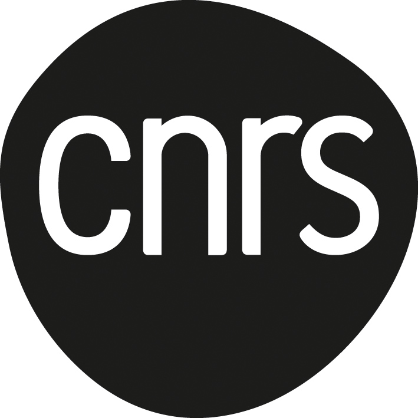
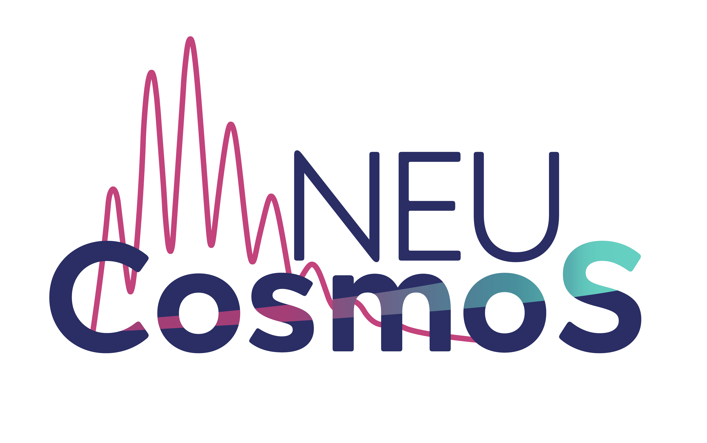
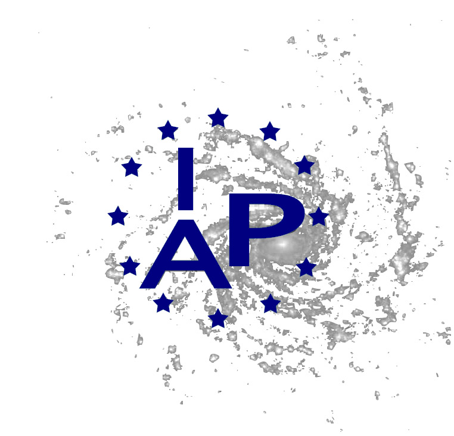

CMB Analysis With A Differentiable Likelihood
===============================================================

:Authors: L\. Balkenhol, C\. Trendafilova, K\. Benabed, S\. Galli

:Paper: ``arxiv shield goes here``

:Source: `<https://github.com/Lbalkenhol/candl>`__

:Documentation: ``right here``

candl is a differentiable likelihood framework for analysing CMB power spectrum measurements.
Key features are:

* JAX-compatibility, allowing for fast and easy computation of gradients and Hessians of the likelihoods.
* The latest public data releases from the South Pole Telescope and Atacama Cosmology Telescope collaborations.
* Interface tools for work with other popular cosmology software packages (e.g. Cobaya and MontePython).
* Auxiliary tools for common analysis tasks (e.g. generation of mock data).

candl supports the analysis of primary CMB and lensing power spectrum data (:math:`TT`, :math:`TE`, :math:`EE`, :math:`BB`, :math:`\phi\phi`, :math:`\kappa\kappa`).

Installation
------------

candl can be installed with pip::

    pip install candl_like

After installation, we recommend testing by executing the following python code::

    import candl.tests
    candl.tests.run_all_tests()

This well test all data sets included in candl.

JAX
---

`JAX <https://github.com/google/jax>`__ is a Google-developed python library.
In its own words: *"JAX is Autograd and XLA, brought together for high-performance numerical computing."*

candl is written in a JAX-friendly way.
That means JAX is optional and you can install and run candl without JAX and perform traditional inference tasks such as MCMC sampling with Cobaya.
However, if JAX is installed, the likelihood is fully differentiable thanks to automatic differentiation and many functions are jitted for speed.

Documentation
--------------

You can build the documentation by executing::

    make html

in the ``docs/`` folder.
There may be some warnings, but there should be no errors.
You can then access the documentation under ``docs/_build/html/index.html``.
Once the repository is public, we can host this properly somewhere.

===================

.. |erc| image:: logos/erc_logo.jpeg
   :alt: ERC
   :height: 100px
   :width: 100px

|cnrs| |erc| |NEUCosmoS| |IAP| |Sorbonne|
